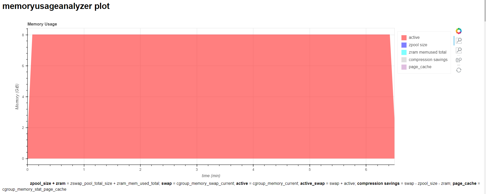
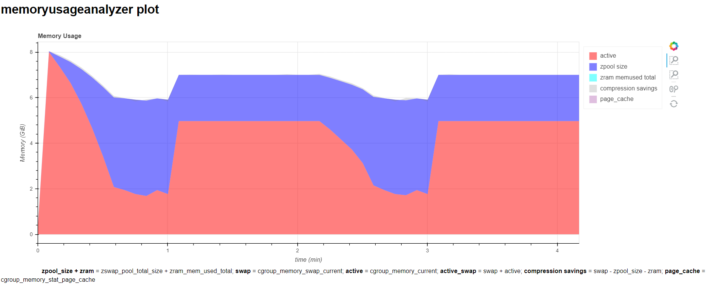
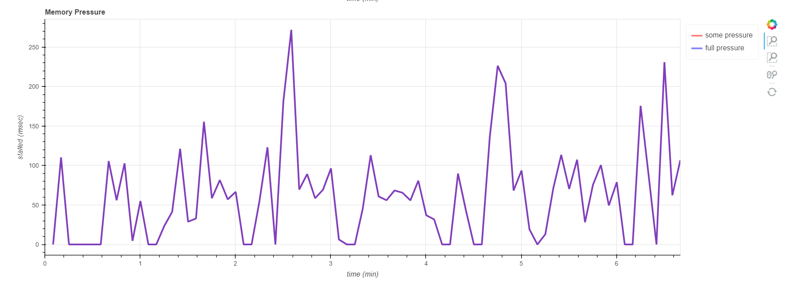
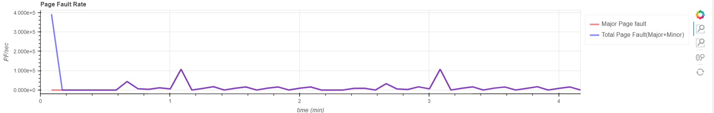
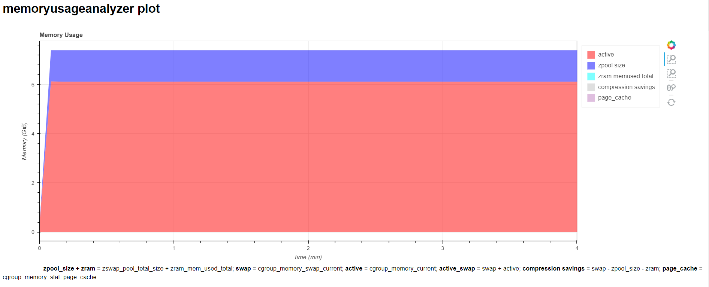
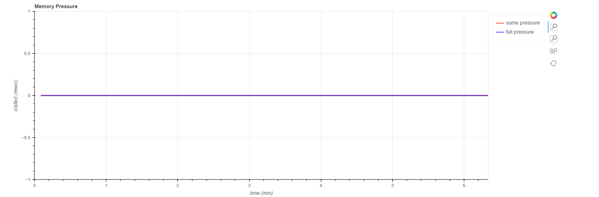
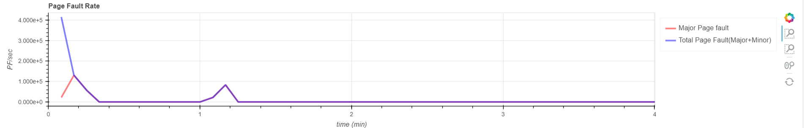

# Example Workload
This section provides usage scenarios of memory-usage-analyzer with an example workloads

## Prepare the example workload
This example workload prepares a large memory segment. A portion of this memory segment is accessed (50% or 75% of the total) to create the memory regions which are the more frequently accessed (hot) and less frequently accessed (cold).
```shell
$ cd tests/example
$ make
$ ./workload
usage ./workload: total_memory(GiB) hot_timer loops
```

The parameters:
* `total_memory` : amount of memory used by the workload in GiB
* `hot_timer` : time period spend in 50% and 75% hot memory modes in seconds
* `loops` : controls the amount of work done, if 0 the workload runs forever

Here's an example run of the workload:
```shell
$ ./workload 8 10 1000
[INFO] (main:34) : pid       = 20141
[INFO] (main:35) : memory    = 8 GiB = 2097152 pages
[INFO] (main:36) : hot timer = 10 sec
[INFO] (main:37) : loops     = 1000
[INFO] (main:51) : Done with setup in 3 seconds.
[INFO] (sigalrm_handler:17) : hot pages = 75%
[INFO] (sigalrm_handler:17) : hot pages = 50%
[INFO] (main:68) : Done with test in 21 seconds.
```

## Profile the Example Workload
There are three different scenarios that are provided here

1. Baseline - Running baseline without any memory pressure and collecting the memory usage statistics
1. Dynamic Squeezer - Running workload under a Cgroup to create memory pressure,  where the memory limit is adjusted dynamically to limit the page fault rate
1. Static Squeezer - Running workload under a Cgroup to create memory pressure, where the memory limit to fixed 

### Simple Workload - Baseline

This is an example of running baseline workload. Before running the workload, system configuration should be performed to enable the data collection.
For system configuration details, please refer [config](../../docs/README.md)

```shell
$ cd tests/example
# Configure the system for data collection
$ config.py
# Configuration ZSWAP compressor
$ zswapcompconfig.py -c lzo-rle
$ memory-usage-analyzer.py -- ./workload 8 60 10000
2024-01-11 01:06:43,576 - memoryusageanalyzer - INFO - args = Namespace(verbose=False, output='profile', output_force=None, sample_period=5, compaction_period=0, docker=None, skip_stats=0, cgpath='/sys/fs/cgroup', cgname='memoryusageanalyzer', reclaimer_config=None, cmd='./workload', options=['8', '60', '10000'])
2024-01-11 01:06:43,581 - memoryusageanalyzer - INFO - **** Storing profiling results in profile
2024-01-11 01:06:43,587 - memoryusageanalyzer - INFO - cgroup v2 enabled and memory controller detected
2024-01-11 01:06:43,592 - memoryusageanalyzer - INFO - **** Starting job in cgroup
2024-01-11 01:06:43,594 - memoryusageanalyzer - INFO - **** Starting stats
[INFO] (main:56) : pid       = 2280839
[INFO] (main:57) : memory    = 8 GiB = 2097152 pages
[INFO] (main:58) : hot timer = 60 sec
[INFO] (main:59) : loops     = 10000
[INFO] (main:73) : Done with setup in 3 seconds.
[INFO] (sigalrm_handler:38) : hot pages = 75%
[INFO] (sigalrm_handler:38) : hot pages = 50%
[INFO] (sigalrm_handler:38) : hot pages = 75%
[INFO] (main:90) : Done with test in 235 seconds.
2024-01-11 01:10:41,313 - memoryusageanalyzer - INFO - **** Job finished
2024-01-11 01:10:41,313 - memoryusageanalyzer - INFO - **** Stopping stats
**** Closing profile/baseline/stats.csv.gz
Total:
Generating plots profile/baseline/memoryusageanalyzer-plots.html
profile/baseline
Loading stats from profile/baseline/stats.csv.gz
Loading stats from profile/baseline/stats.csv.gz
*** Totals without page cache ***
Maximum active+swap memory           = 8.021 GiB
Max active memory                 = 8.0 GiB
Max swap memory                = 0.0 GiB
Max page cache                 = 0.000 GiB
Swap memory                    = 0.0%
Max inactive anon              = 8.004 GiB
Maximum zpool memory           = 0.000000 GiB
Maximum zram memory            = 0.000011 GiB
incompressible data ratio(zram)= 0.0%
full total memory pressure            = 0 us
Major PFs/sec (median, avg, max) = 0.00 0.00              0.00
Total PFs/sec (median, avg, max) = 0.00 8224.54          386553.33
Total PFs (Major+Minor) = 1933892
Major PFs = 0
Total Diff (difference b/w total (8.02 GiB)  and              cgroup_total_max(8.00 GiB)) = 0.02 GiB
file sum: 0.00 GiB
sampling period = 5.00290871681051
```
The analyzer output is also saved at profile/baseline/analyze.out. The visualization of the memory usage will be at profile/baseline/memoryusageanalyzer-plots.html as shown below.



###  Example Workload with dynamic squeezer
This is an example where dynamic memory-limit is applied to workload through cgroup with page-fault rate as the metric. The memory limit is applied gradually to the workload till the page-fault-rate reaches the threshold. After that, dynamic squeezer adjusts the memory limit to keep the page-fault-rate within the threshold by relaxing the memory-limit.
Please refer to the config file for dynamic squeezer in the repo memory-usage-analyzer/src/reclaimer/

With dynamic squeezer
```shell
$ cd tests/example
$ config.py
$ zswapcompconfig.py -c lzo-rle
$ memory-usage-analyzer.py -r ../../src/reclaimer/squeezerdynamicconfig.json -- ./workload 8 60 10000
2024-01-11 01:17:28,302 - memoryusageanalyzer - INFO - args = Namespace(verbose=False, output='profile', output_force=None, sample_period=5, compaction_period=0, docker=None, skip_stats=0, cgpath='/sys/fs/cgroup', cgname='memoryusageanalyzer', reclaimer_config='../../src/reclaimer/squeezerdynamicconfig.json', cmd='./workload', options=['8', '60', '10000'])
2024-01-11 01:17:28,303 - memoryusageanalyzer - INFO - **** Storing profiling results in profile.2
2024-01-11 01:17:28,327 - memoryusageanalyzer - INFO - cgroup v2 enabled and memory controller detected
2024-01-11 01:17:28,332 - memoryusageanalyzer - INFO - **** Starting job in cgroup
2024-01-11 01:17:28,335 - memoryusageanalyzer - INFO - **** Starting stats
2024-01-11 01:17:28,338 - memoryusageanalyzer - INFO - **** Starting reclaimer
memory usage = 12,296,192 pf_rate = 0.4 =>                  squeeze percent = 1%
   squeeze to 12,173,230 -- ok
[INFO] (main:56) : pid       = 22840
[INFO] (main:57) : memory    = 8 GiB = 2097152 pages
[INFO] (main:58) : hot timer = 60 sec
[INFO] (main:59) : loops     = 10000
[INFO] (main:73) : Done with setup in 3 seconds.
memory usage = 8,625,553,408 pf_rate = 0.0 =>                  squeeze percent = 2%
   squeeze to 8,453,042,339 -- ok
memory usage = 8,441,901,056 pf_rate = 7.4 =>                  squeeze percent = 3%
   squeeze to 8,188,644,024 -- ok
memory usage = 8,187,904,000 pf_rate = 0.0 =>                  squeeze percent = 4%
   squeeze to 7,860,387,840 -- ok
memory usage = 7,860,129,792 pf_rate = 0.0 =>                  squeeze percent = 5%
   squeeze to 7,467,123,302 -- ok
memory usage = 7,466,840,064 pf_rate = 0.0 =>                  squeeze percent = 6%
   squeeze to 7,018,829,660 -- ok
memory usage = 7,018,418,176 pf_rate = 0.0 =>                  squeeze percent = 7%
   squeeze to 6,527,128,903 -- ok
memory usage = 6,526,992,384 pf_rate = 0.0 =>                  squeeze percent = 8%
   squeeze to 6,004,832,993 -- ok
memory usage = 6,394,126,336 pf_rate = 44327.6 =>                  squeeze percent = 0%
memory usage = 6,394,126,336 pf_rate = 0.0 =>                  squeeze percent = 1%
   squeeze to 6,330,185,072 -- ok
memory usage = 6,393,978,880 pf_rate = 5119.2 =>                  squeeze percent = 2%
   squeeze to 6,266,099,302 -- ok
memory usage = 6,394,060,800 pf_rate = 13177.0 =>                  squeeze percent = 0%
memory usage = 6,394,060,800 pf_rate = 0.0 =>                  squeeze percent = 1%
   squeeze to 6,330,120,192 -- ok
[INFO] (sigalrm_handler:38) : hot pages = 75%
memory usage = 7,501,524,992 pf_rate = 110001.0 =>                  squeeze percent = 0%
memory usage = 7,501,524,992 pf_rate = 0.0 =>                  squeeze percent = 1%
   squeeze to 7,426,509,742 -- ok
memory usage = 7,501,512,704 pf_rate = 6083.4 =>                  squeeze percent = 2%
   squeeze to 7,351,482,449 -- ok
memory usage = 7,501,488,128 pf_rate = 13231.8 =>                  squeeze percent = 0%
memory usage = 7,501,488,128 pf_rate = 0.0 =>                  squeeze percent = 1%
   squeeze to 7,426,473,246 -- ok
memory usage = 7,501,504,512 pf_rate = 7110.4 =>                  squeeze percent = 2%
   squeeze to 7,351,474,421 -- ok
memory usage = 7,501,541,376 pf_rate = 13285.2 =>                  squeeze percent = 0%
memory usage = 7,501,541,376 pf_rate = 0.0 =>                  squeeze percent = 1%
   squeeze to 7,426,525,962 -- ok
memory usage = 7,501,303,808 pf_rate = 6148.0 =>                  squeeze percent = 2%
   squeeze to 7,351,277,731 -- ok
memory usage = 7,501,455,360 pf_rate = 13261.8 =>                  squeeze percent = 0%
memory usage = 7,501,455,360 pf_rate = 0.0 =>                  squeeze percent = 1%
   squeeze to 7,426,440,806 -- ok
memory usage = 7,501,488,128 pf_rate = 6214.0 =>                  squeeze percent = 2%
   squeeze to 7,351,458,365 -- ok
[INFO] (sigalrm_handler:38) : hot pages = 50%
memory usage = 7,501,537,280 pf_rate = 13225.8 =>                  squeeze percent = 0%
memory usage = 7,501,537,280 pf_rate = 0.0 =>                  squeeze percent = 1%
   squeeze to 7,426,521,907 -- ok
memory usage = 7,501,312,000 pf_rate = 6149.6 =>                  squeeze percent = 2%
   squeeze to 7,351,285,760 -- ok
memory usage = 7,350,353,920 pf_rate = 0.0 =>                  squeeze percent = 3%
   squeeze to 7,129,843,302 -- ok
memory usage = 7,129,612,288 pf_rate = 0.0 =>                  squeeze percent = 4%
   squeeze to 6,844,427,796 -- ok
memory usage = 6,847,692,800 pf_rate = 0.0 =>                  squeeze percent = 5%
   squeeze to 6,505,308,160 -- ok
memory usage = 6,505,140,224 pf_rate = 0.0 =>                  squeeze percent = 6%
   squeeze to 6,114,831,810 -- ok
memory usage = 6,394,183,680 pf_rate = 25475.2 =>                  squeeze percent = 0%
memory usage = 6,394,183,680 pf_rate = 0.0 =>                  squeeze percent = 1%
   squeeze to 6,330,241,843 -- ok
memory usage = 6,394,032,128 pf_rate = 5864.2 =>                  squeeze percent = 2%
   squeeze to 6,266,151,485 -- ok
memory usage = 6,394,142,720 pf_rate = 11159.4 =>                  squeeze percent = 0%
memory usage = 6,394,142,720 pf_rate = 0.0 =>                  squeeze percent = 1%
   squeeze to 6,330,201,292 -- ok
[INFO] (sigalrm_handler:38) : hot pages = 75%
memory usage = 7,501,459,456 pf_rate = 109960.4 =>                  squeeze percent = 0%
memory usage = 7,501,459,456 pf_rate = 0.0 =>                  squeeze percent = 1%
   squeeze to 7,426,444,861 -- ok
memory usage = 7,501,557,760 pf_rate = 6613.6 =>                  squeeze percent = 2%
   squeeze to 7,351,526,604 -- ok
memory usage = 7,501,357,056 pf_rate = 14634.6 =>                  squeeze percent = 0%
memory usage = 7,501,357,056 pf_rate = 0.0 =>                  squeeze percent = 1%
   squeeze to 7,426,343,485 -- ok
memory usage = 7,501,479,936 pf_rate = 6908.4 =>                  squeeze percent = 2%
   squeeze to 7,351,450,337 -- ok
memory usage = 7,501,471,744 pf_rate = 14469.8 =>                  squeeze percent = 0%
memory usage = 7,501,471,744 pf_rate = 0.0 =>                  squeeze percent = 1%
   squeeze to 7,426,457,026 -- ok
memory usage = 7,501,438,976 pf_rate = 6163.6 =>                  squeeze percent = 2%
   squeeze to 7,351,410,196 -- ok
memory usage = 7,501,406,208 pf_rate = 15631.0 =>                  squeeze percent = 0%
memory usage = 7,501,406,208 pf_rate = 0.0 =>                  squeeze percent = 1%
   squeeze to 7,426,392,145 -- ok
memory usage = 7,501,303,808 pf_rate = 5748.6 =>                  squeeze percent = 2%
   squeeze to 7,351,277,731 -- ok
[INFO] (sigalrm_handler:38) : hot pages = 50%
memory usage = 7,501,402,112 pf_rate = 13539.6 =>                  squeeze percent = 0%
memory usage = 7,501,402,112 pf_rate = 0.0 =>                  squeeze percent = 1%
   squeeze to 7,426,388,090 -- ok
memory usage = 7,426,228,224 pf_rate = 0.0 =>                  squeeze percent = 2%
   squeeze to 7,277,703,659 -- ok
memory usage = 7,277,514,752 pf_rate = 0.0 =>                  squeeze percent = 3%
   squeeze to 7,059,189,309 -- ok
memory usage = 7,058,964,480 pf_rate = 0.0 =>                  squeeze percent = 4%
   squeeze to 6,776,605,900 -- ok
[INFO] (main:90) : Done with test in 268 seconds.
memory usage = 6,783,467,520 pf_rate = 0.0 =>                  squeeze percent = 5%
   squeeze to 6,444,294,144 -- ok
memory usage = 9,973,760 pf_rate = 35.6 =>                  squeeze percent = 6%
   squeeze to 9,375,334 -- ok
2024-01-11 01:21:53,211 - memoryusageanalyzer - INFO - **** Job finished
2024-01-11 01:21:53,211 - memoryusageanalyzer - INFO - **** Stopping stats
**** Closing profile.14/dynamic/stats.csv.gz
**** Squeezer exiting
2024-01-11 01:21:53,647 - memoryusageanalyzer - INFO - **** Stopping squeezer
Total:
Generating plots profile/dynamic/memoryusageanalyzer-plots.html
profile/dynamic
Loading stats from profile/dynamic/stats.csv.gz
Loading stats from profile/dynamic/stats.csv.gz
*** Totals without page cache ***
Maximum active+swap memory           = 8.023 GiB
Max active memory                 = 8.0 GiB
Max swap memory                = 4.2 GiB
Max page cache                 = 0.012 GiB
Swap memory                    = 51.7%
Max inactive anon              = 8.003 GiB
Maximum zpool memory           = 2.046429 GiB
Maximum zram memory            = 0.000011 GiB
incompressible data ratio(zram)= 0.0%
full total memory pressure            = 0 us
Average swap memory comp ratio = 2.00
Potential maximum compression savings in percent =                  3.1%
Potential median compression savings in percent =                  12.5%
Potential compression savings in bytes =                  0.251 GiB
Average swap memory comp ratio = 2.00                  (including same filled pages)
Major PFs/sec (median, avg, max) = 2080.65 10466.45              111922.21
Total PFs/sec (median, avg, max) = 2768.80 17661.16          388511.95
Total PFs (Major+Minor) = 4770924
Major PFs = 2827370
Total Diff (difference b/w total (8.05 GiB)  and              cgroup_total_max(8.01 GiB)) = 0.04 GiB
file sum: 0.01 GiB
sampling period = 5.002528270085652
```
Visualizations




A memory usage report is generated after the profiling runs are complete.
The default results path is profile* and we can also override the default path using the -o option.

###  Example Workload with static squeezer
This is an example where static  memory-limit is applied to workload through cgroup. The fixed memory limit on Cgroup can be a percentage of the maximum baseline memory usage.

Please refer the static squeezer config file in the repo memory-usage-analyzer/src/reclaimer/

With static squeezer
```shell
$ cd tests/example
$ config.py
$ zswapcompconfig.py -c lzo-rle
$ memory-usage-analyzer.py -r ../../src/reclaimer/squeezerstaticconfig.json -- ./workload 8 60 10000
2024-03-04 00:31:55,925 - memoryusageanalyzer - INFO - args = Namespace(cgname='memoryusageanalyzer', cgpath='/sys/fs/cgroup', cmd='./workload', docker=None, options=['8', '60', '1000'], output='profile', outputforce=None, reclaimerconfig='../../src/reclaimer/squeezerstaticconfig.json', sampleperiod=5, verbose=False)
2024-03-04 00:31:55,925 - memoryusageanalyzer - INFO - **** Storing profiling results in profile.8
2024-03-04 00:31:55,987 - memoryusageanalyzer - INFO - cgroup v2 enabled and memory controller detected
2024-03-04 00:31:55,992 - memoryusageanalyzer - INFO - **** Starting job in cgroup
2024-03-04 00:31:55,994 - memoryusageanalyzer - INFO - **** Starting stats
2024-03-04 00:31:55,997 - memoryusageanalyzer - INFO - **** Starting reclaimer
[INFO] (main:43) : pid       = 9364
[INFO] (main:44) : memory    = 8 GiB = 2097152 pages
[INFO] (main:45) : hot timer = 60 sec
[INFO] (main:46) : loops     = 1000
[INFO] (main:60) : Done with setup in 6 seconds.
[INFO] (main:77) : Done with test in 43 seconds.
2024-03-04 00:32:46,040 - memoryusageanalyzer - INFO - **** Job finished
2024-03-04 00:32:46,040 - memoryusageanalyzer - INFO - **** Stopping stats
**** Closing profile.8/staticsweep/stats.csv.gz
2024-03-04 00:32:46,547 - memoryusageanalyzer - INFO - **** Stopping squeezer
Generating plots profile.8/staticsweep/memoryusageanalyzer-plots.html
2024-03-04 00:32:48,036 - memoryusageanalyzer - INFO - cgroup v2 enabled and memory controller detected
2024-03-04 00:32:48,040 - memoryusageanalyzer - INFO - **** Starting job in cgroup
2024-03-04 00:32:48,042 - memoryusageanalyzer - INFO - **** Starting stats
2024-03-04 00:32:48,045 - memoryusageanalyzer - INFO - **** Starting reclaimer
[INFO] (main:43) : pid       = 9751
[INFO] (main:44) : memory    = 8 GiB = 2097152 pages
[INFO] (main:45) : hot timer = 60 sec
[INFO] (main:46) : loops     = 1000
[INFO] (main:60) : Done with setup in 7 seconds.
[INFO] (main:77) : Done with test in 41 seconds.
2024-03-04 00:33:37,230 - memoryusageanalyzer - INFO - **** Job finished
2024-03-04 00:33:37,230 - memoryusageanalyzer - INFO - **** Stopping stats
**** Closing profile.8/staticsweep/memory_8/stats.csv.gz
2024-03-04 00:33:38,593 - memoryusageanalyzer - INFO - **** Stopping squeezer
Generating plots profile.8/staticsweep/memory_8/memoryusageanalyzer-plots.html
**** Squeezer exiting
profile.8/staticsweep
Loading stats from profile.8/staticsweep/stats.csv.gz
Loading stats from profile.8/staticsweep/stats.csv.gz
*** Totals without page cache ***
Maximum active+swap memory           = 6.749 GiB
Max active memory                 = 5.8 GiB
Max swap memory                = 2.5 GiB
Max page cache                 = 0.014 GiB
Swap memory                    = 30.9%
Max inactive anon              = 5.765 GiB
Maximum zpool memory           = 1.234447 GiB
Maximum zram memory            = 0.000011 GiB
incompressible data ratio(zram)= 0.0%
full total memory pressure            = 0 us
Average swap memory comp ratio = 2.00
Potential maximum compression savings in percent =                  15.5%
Potential median compression savings in percent =                  15.5%
Potential compression savings in bytes =                  1.234 GiB
Average swap memory comp ratio = 2.00                  (including same filled pages)
Major PFs/sec (median, avg, max) = 0.00 23234.00              110352.45
Total PFs/sec (median, avg, max) = 0.00 61738.39          333850.16
Total PFs (Major+Minor) = 2786383
Major PFs = 1048599
Total Diff (difference b/w total (7.98 GiB)  and              cgroup_total_max(8.01 GiB)) = 0.02 GiB
file sum: 0.01 GiB
sampling period = 5.014677789476183

**** Using max_limit from baseline run: 7247048704.0 =                      6.749 GiB
**** Initial memory limit = 6667284807
**** Squeezer exiting
profile.8/staticsweep/memory_8
Loading stats from profile.8/staticsweep/memory_8/stats.csv.gz
Loading stats from profile.8/staticsweep/memory_8/stats.csv.gz
*** Totals without page cache ***
Maximum active+swap memory           = 6.210 GiB
Max active memory                 = 5.2 GiB
Max swap memory                = 3.5 GiB
Max page cache                 = 0.013 GiB
Swap memory                    = 44.1%
Max inactive anon              = 5.169 GiB
Maximum zpool memory           = 1.757580 GiB
Maximum zram memory            = 0.000011 GiB
incompressible data ratio(zram)= 0.0%
full total memory pressure            = 0 us
Average swap memory comp ratio = 2.00
Potential maximum compression savings in percent =                  22.1%
Potential median compression savings in percent =                  22.1%
Potential compression savings in bytes =                  1.758 GiB
Average swap memory comp ratio = 2.00                  (including same filled pages)
Major PFs/sec (median, avg, max) = 0.00 23233.96              123145.11
Total PFs/sec (median, avg, max) = 0.00 61923.90          310562.05
Total PFs (Major+Minor) = 2794760
Major PFs = 1048599
Total Diff (difference b/w total (7.97 GiB)  and              cgroup_total_max(8.01 GiB)) = 0.04 GiB
file sum: 0.01 GiB
sampling period = 5.01468547185262
```

Visualizations




A memory usage report is generated after the profiling runs are complete.
The default results path is profile* and we can also override the default path using the -o option.

### To run a workload in a docker container:
1. Give the workload's docker container a name on the docker command line (`--name NAME`)
2. For convenience, have docker automatically remove the container when it exits, so the container name can be reused (`--rm`)
3. Add the `--docker NAME` to the `memory-usage-analyzer.py` command.

If cgroup v2 is enabled, do specify the cgroup parent by `--cgroup-parent <memoryusageanalyzer.slice>`, otherwise stats won't be collected correctly.
```shell
$ docker info
Cgroup Version: 2
$ docker run --rm --name memoryusageanalyzer --cgroup-parent <memoryusageanalyzer.slice> -v $PWD:/memoryusageanalyzer ubuntu /memoryusageanalyzer/workload 4 30 1000
```

Example:
```shell
$ cat docker.sh
#!/usr/bin/env bash

sudo docker run --rm --name memoryusageanalyzer -v $PWD:/memoryusageanalyzer ubuntu /memoryusageanalyzer/example/workload 4 30 1000

$ memory-usage-analyzer.py --docker memoryusageanalyzer ./docker.sh
2024-01-17 00:03:09,703 - memoryusageanalyzer - INFO - args = Namespace(verbose=False, output='profile', output_force=None, sample_period=5, compaction_period=0, docker='memoryusageanalyzer', skip_stats=0, cgpath='/sys/fs/cgroup', cgname='memoryusageanalyzer', reclaimer_config=None, cmd='./docker.sh', options=[])
2024-01-17 00:03:09,703 - memoryusageanalyzer - INFO - **** Storing profiling results in profile
2024-01-17 00:03:09,708 - memoryusageanalyzer - INFO - cgroup v2 enabled and memory controller detected
2024-01-17 00:03:09,713 - memoryusageanalyzer - INFO - **** Starting job in docker
2024-01-17 00:03:09,715 - memoryusageanalyzer - INFO - **** Waiting for container "memoryusageanalyzer"
[INFO] (main:56) : pid       = 1
[INFO] (main:57) : memory    = 4 GiB = 1048576 pages
[INFO] (main:58) : hot timer = 30 sec
[INFO] (main:59) : loops     = 1000
[INFO] (main:73) : Done with setup in 0 seconds.
2024-01-17 00:03:10,879 - memoryusageanalyzer - INFO - **** Found container "memoryusageanalyzer" = 659881870e44e57696553cd1c19ac0710c43bfa7ed94bb917c6db328b468b72f
2024-01-17 00:03:10,895 - memoryusageanalyzer - INFO - **** Starting stats
[INFO] (main:90) : Done with test in 10 seconds.
2024-01-17 00:06:41,304 - memoryusageanalyzer - INFO - **** Job finished
2024-01-17 00:06:41,304 - memoryusageanalyzer - INFO - **** Stopping stats
**** Closing profile/baseline/stats.csv.gz
```
